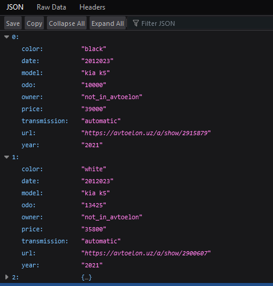
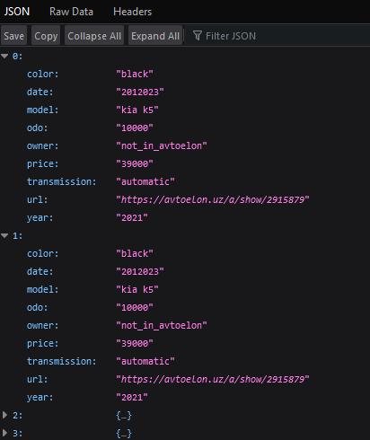
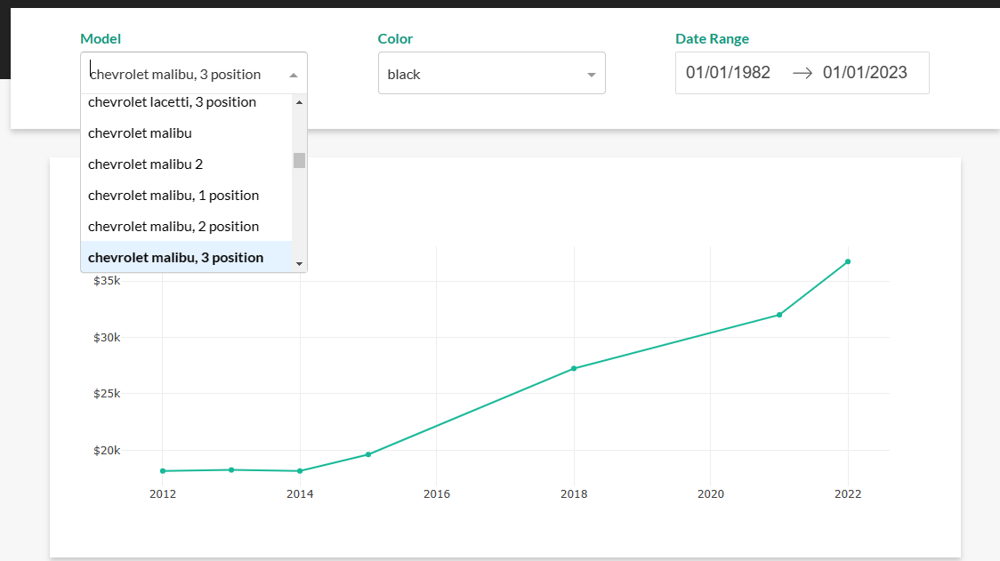
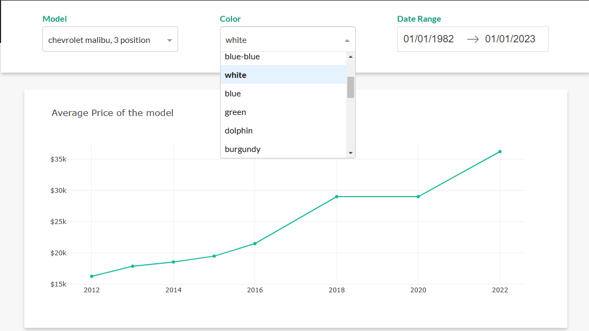

# scrape_api_viz
This is a pet project.
The main purpose is collecting data about cars in UZ/TASH.

1. Scraping process gets information about the cars from https://olx.uz and https://avtoelon.uz.
   Scraping is based on Selenium, then a new CSV file is created, based on the results of web scraping, the last step for this service is put csv files to the S3 bucket.
2. API is based on Flask
* http://"ipaddress":5050/api/csv - download the whole csv file 
* http://"ipaddress":5050/api/"model" - shows the specific model

* http://"ipaddress":5050/api/"model"/"color" or/and "transmission" or/and "transmission"

3. Visualization is based on DASH, can filter on model and color

