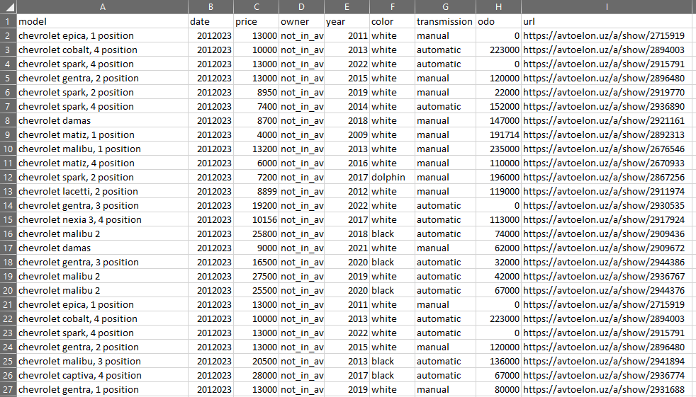

# scrape_api_viz
This is a pet project.
The main purpose is to collect data about cars in UZ/TASH.

1. Scraping process gets information about the cars from https://olx.uz and https://avtoelon.uz.
   Scraping is based on Selenium, then a new CSV file is created, based on the results of web scraping, the last step for this service is to put the CSV file into the S3 bucket.
* Example of the CSV file

2. API is based on Flask
* http://"IP_ADDRESS":5050/api/csv - download the whole CSV file 
* http://"IP_ADDRESS":5050/api/"model" - shows the specific model

* http://"IP_ADDRESS":5050/api/"model"/"color" or/and "transmission" or/and "transmission"
* There is an example with color - black\

3. Visualization is based on DASH, which can filter on model and color
* http://"IP_ADDRESS"/

